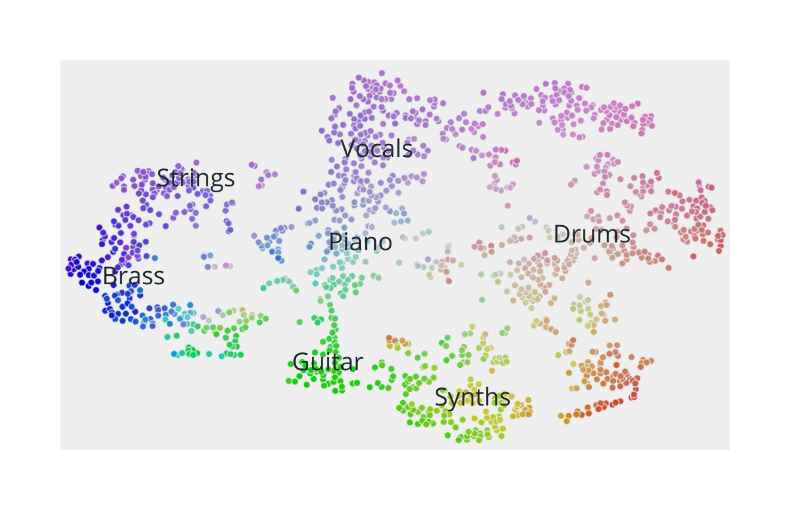
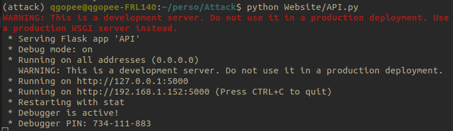
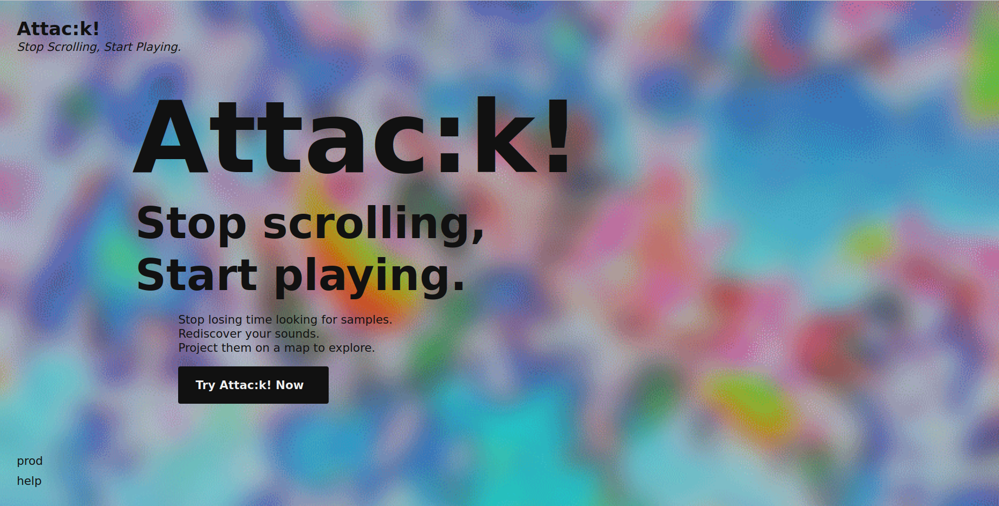
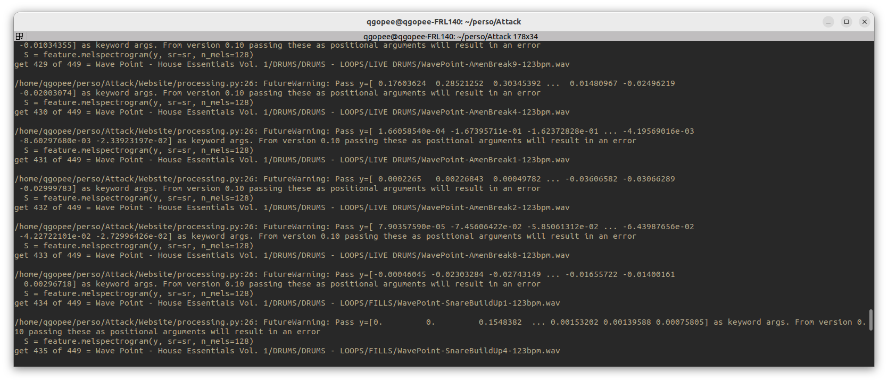
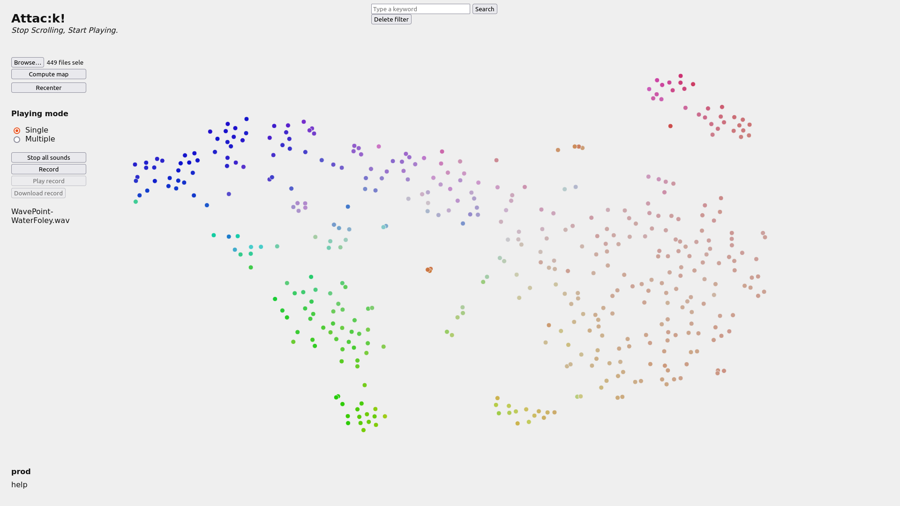

# Attac:k!
## Stop Scrolling, Start Playing.

**Attac:k!** is a project whose objective is to help musicians to organize and explore their sample packs. The idea is to propose an alternative to the traditional files explorers that do not suit the exploration of sample packs. How do we do that? By creating maps! Those maps sort sounds by similarity and allow musicians to naviguate flowlessly and intuitively in their sample packs *(for more information on the project please refer to the **Pitch Deck** and to **How it works**)*.

|  | 
|:--:| 
| *Example of a map* |

## The prototype

We decided to make a webapp as an MVP but it is not hosted anywhere, so if you want to try it you will have to run it locally. This project is on hold since early 2022, but the current prototype version should work on your computer.

### Install the MVP on your computer

If you are comfortable with python you can skip this section (just clone the repo and install the requirements).

Else, here is a step by step tutorial to download and install the prototype:

- Download the code by clicking on 'Code' then 'Download ZIP' at the top of this webpage
- Unzip the files where you want
- If you don't already have python, install it on your computer (you can follow this [tutorial](https://realpython.com/installing-python/))
- From a terminal, go to the folder of the prototype (if you don't know how to this, check how to use the ```cd``` command)
- run the command ```pip install -r requirements.txt``` to install all the necessary packages

And that's it, the MVP is ready to use!

### Run the MVP on your computer

From a terminal, go to the folder of the prototype and run ```python Website/API.py```.

This command will start a local server on your computer, you can now access the prototype from a web navigator at this address: http://localhost:5000/

|  | 
|:--:| 
| *Start the local server with the command ```python Website/API.py```* |

http://localhost:5000/ is the main page of the website. You can try the prototype by clicking on **Try Attac:k! now**, or directly go to http://localhost:5000/prod.

|  | 
|:--:| 
| *Main page of the website* |

### Create a map

When you arrive on the prod page, you will see some buttons and an empty background. It is normal, you haven't created any map yet! To do so, click on the **Browse** button (at the top left) and select a sample pack. If you don't have any sample pack on your computer but still want to try the prototype, you can download [this one](https://www.dropbox.com/s/ibfhkf3wf9lnt7a/Wave%20Point%20-%20House%20Essentials%20Vol.%201.zip?dl=0).

Once you've uploaded the files, click on **Compute map**. The page will display "Computing..." under the button while it's computing the map. This can take some time (arround 20 seconds for 500 samples), but unfortunatly there is no feedback displayed on the page. If you want to know what is happening, you can check your terminal, you should have the information about the computation displayed there.

|  | 
|:--:| 
| *Info on the computation displayed in the terminal* |

Once the computation is done, your map is displayed on the screen! You can already start to play arround with it: move your mouse over the points to trigger the samples (I tried to make some cool visual effects matching the sounds triggered :) ). You should quickly identify different regions with different types of sound. Two points having similar colors and being close to each other sould sound similar.

|  | 
|:--:| 
| *Once the computation is done, you can start to play arround and trigger samples by moving your mouse over the points* |

### The fonctionnalities

- Zoom into the map by scrolling and move it by clicking and moving your mouse at the same time. If you get lost, you can click on the **Recenter** button to reset the position of the map.
- There are two different modes: **Single** and **Multiple**. In single mode, only on sound can be triggered at a time, while in multiple mode you can trigger as many sounds as you want at the same time.
- The multiple mode is very cool but can be a bit dangerous for your ears, that's why there is a **Stop all sounds** button, that stop all the sounds playing. You can also do this by hitting the ```Esc``` key on your keyboard.
- You can record what is happening on the page by clicking on **Record** or doing ```Shift``` + ```R```. Click again the button (that is now **Stop recording**) or do ```Shift``` + ```R``` again.
- To play the record you've done, click on **Play** or hit the ```Space bar```. Clik on **Pause** or on the ```Space bar``` to stop it.
- To download the record you've done, press **Download record**.
- You can assign a sound to a key of your keyboard by right clicking on a point and then hitting the key to which you want to assign it. The next time you will press this key, it will trigger the sound you assigned (however this doesn't work very well, there is some latency).
- There is a searchbar at the top of the page. Type in what you want, and then click on search or press ```Enter``` to apply a filter on the map. All the points will become grey and stop being interactive, except the sounds containing what you typed in the search bar in their names. To delete the filter, just press **Delete filter**.
- To create a new map, upload other samples by clicking on **Browse** and hit again the **Compute Map** button

### Enjoy

Now you know everything there is to know about the prototype, just have fun :)
